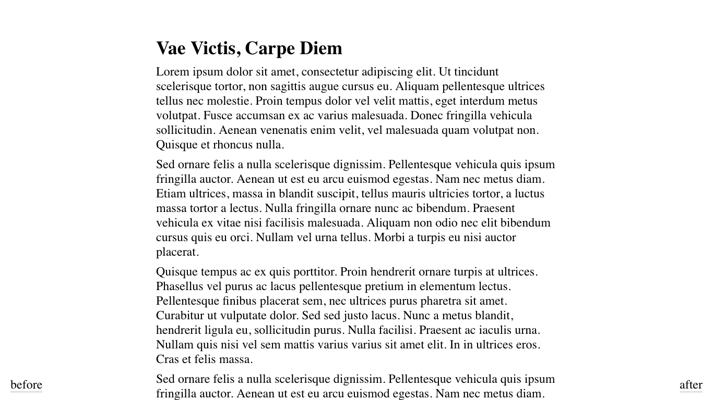

# haiku for WordPress

Haiku is a hyperminimalistic theme for WordPress blogs. Originally created for [ErikBoesen](https://github.com/ErikBoesen)'s [Daily Haiku Blog](http://erikboesen.com/haiku), it is now available for public usage. Unlike the original, this version of the theme is compatible with larger posts and shows post titles.

---
## Installation
If you're installing the already built version of the theme, download the latest zip file of the theme [here](https://github.com/ErikBoesen/haiku/releases), then continue to the [loading](#Loading) section.

To build the theme yourself, clone or download the code, perform any desired modifications, and compress the files (minus README.md and any other unnecessary files) into a zip file. Continue to the [loading](#Loading) section.

### Loading
1. Open your WordPress dashboard, and go to the Appearance > Themes page.
2. Add New > Upload Theme > Choose file.
3. Click "Choose File" and find the zip file you downloaded.
4. Click "Install Now" and wait for the theme to upload.
5. Click activate to finish the installation.

## Features
* Ridiculously low footprint and page sizes (~110 bytes not including post contents)
* 100% responsive
* No custom fonts or external resources and still looks beautiful

## License
You can do anything you want with this code, as long as you don't say you made it.
Other than that, there's no bothersome copyright in the footer or anything, so go ahead and do what you want.
